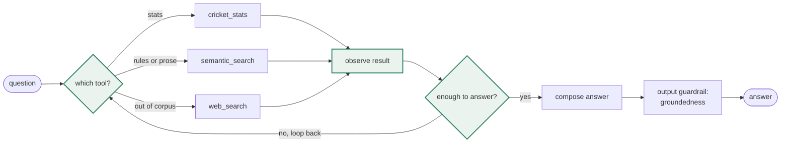
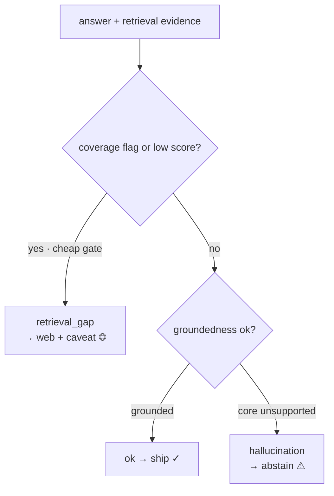

# Cricket Guru

A cricket question-answering agent that routes each question to the source that actually holds the answer — exact numbers from a structured match database, narrative from an encyclopedic text index, and a web-search freshness check for records. Built to compare, at each pipeline leg, two prominent approaches against a simple baseline rather than reaching for the optimal one first.

Group: IP8, Cricket Guru. Framework: Pydantic AI.

Live demo: <https://cricket-guru-production.up.railway.app>

## The idea

Cricket knowledge lives in two incompatible shapes. Prose holds narrative (why a match mattered, how a rule works); structured records hold exact facts (most runs in IPL 2016). No single retrieval method serves both, and records go stale the moment they break. So Cricket Guru is an agent that reads the question and picks the right tool, and the project measures where each approach wins.

## How it works

A question passes input guardrails (cricket-relevance, a prompt-injection check, safety), the router picks how to answer, one arm answers, and a critic decides whether it ships.


Three arms answer:

- **stats-SQL** — text-to-SQL over the Cricsheet Postgres. The model writes one read-only query, it runs, and a phraser turns the rows into a sentence. This is the objective oracle for numbers; it can't answer history, records, or captaincy (there is no captain column), so those route to prose.
- **text-RAG** — retrieve chunks from Qdrant (wiki prose or the rules corpus) and answer only from them.
- **web search** — a freshness check for records and facts the corpus can't hold.

The router is either a keyword rule-router (the baseline) or a Pydantic AI tool-calling agent (the serving default). The agent runs a ReAct loop: think about which tool the question needs, call it, read the result, and loop until it can answer, trying another tool when one comes up short.

On the wiki arm a **cross-encoder reranker** (`bge-reranker-base`) re-scores the top 20 retrieved chunks and keeps the top 5, which lifts wiki recall@1 from 60% to 80% — the right passage is usually retrieved but ranked too low. It is wiki-only: rules already rank the right clause first about 90% of the time, where reranking slightly hurts.

## The ReAct loop

The agent thinks about which tool the question needs, calls it, reads the result, and loops until it can answer. When one tool comes up short, it tries another; the final answer passes a groundedness guardrail before the critic sees it.



The multi-step gold set exists to check the loop actually decomposes: a question that needs two tools (a stats lookup feeding a rules lookup) is scored on both the answer and the trace, so a right answer reached in one hop still fails.

## The CRAG critic

After the agent returns, a critic grades the finished answer and, on a bad grade, takes a corrective action instead of shipping (Corrective RAG).



- **ok** — grounded, and its scope sits inside the data window. Ship.
- **retrieval_gap** — the corpus lacks it and the web can reliably fill it (a recent result, prose the encyclopedia doesn't hold). Ship the web answer with a caveat.
- **hallucination / abstain** — the evidence doesn't support the answer, or it is an all-time record reaching before the data window, where the database figure is truncated and the web can't be trusted for the precise value. Abstain, and show the reason.

The coverage call is the critic model's own reasoning over the data window, not a regex. Give it the window (Tests 2001+, ODIs 2002+, T20Is 2005+, IPL 2008+) and it works out scope: a T20I record is complete because T20Is only exist inside the window; an all-time Test record is not, because Tests date to 1877. An earlier regex version flagged any "highest/most" question and wrongly sent a complete in-window record ("highest India–Australia T20 total", 235) to the web, which handed back a wrong 272. The model reasons it through and ships the 235.

## What's compared (each leg: baseline → advanced, one leg at a time)

This is an offline eval, not a mode in the app: `python -m cricket_guru.eval.run_experiments` runs each leg's baseline against its advanced variant on the frozen gold set, across combinations. The app serves the one configuration that won.

| Leg | Baseline | Advanced |
|---|---|---|
| L1 Chunking | fixed-size | structural |
| L3 Retrieval | dense | hybrid (dense + BM25) |
| L4 Reranking | bi-encoder ranking | cross-encoder rerank on wiki (`bge-reranker-base`) |
| L5 Routing | rule/keyword | LLM tool-calling agent |
| L6 Judge | same-model | cross-model (different model, same vendor) |

## What each leg taught

- **Chunking.** Rules split on clause numbers, wiki on paragraphs. Structural chunking degrades to arbitrary windows on rulebook PDFs, which have no paragraph breaks, so rules needed a clause-aware splitter — on the Hit Wicket law, fixed windows cut mid-clause where the clause-aware splitter keeps one rule per chunk.
- **Retrieval.** Dense for rules, hybrid for wiki; the hit score is the dense cosine, not the fused rank.
- **Routing.** Good tool descriptions and coverage notes do the routing, not hardcoded keyword rules. A small model kept pace with a strong one on that basis; the numbers here are measured on Sonnet. The biggest narrative finding surfaced here: accuracy was **route-capped, not retrieval-capped**. The wiki arm on its own answers 96% of narrative questions, but the agent managed 64% — it misrouted history and record questions that *look* statistical ("most wickets in a single World Cup", "Kohli's captaincy record") to the stats arm, where they can't be answered. Making the tool contracts concrete about what each source can and can't hold lifted the agent to ~84%. The bottleneck was orchestration, not retrieval.
- **Stats-SQL.** The biggest lever was the schema. A bare column list made the model infer meaning from column names and guess wrong: `bowling_team` on the wrong table, `runs_batter` (runs off one ball, 0–6) treated as an innings total, so "which match did Kohli score 82 in?" returned nothing. An annotated schema — every column's meaning, units, and granularity — fixed those. It also spells out what the database *can't* hold: no captaincy, no records that predate the window — so those route to prose instead of the model fabricating them. A live Border–Gavaskar query surfaced two subtler traps: `COALESCE(SUM(...), 0)` turned "no rows" into a real-looking 0 that shipped as a tally (an all-NULL single row now reads as empty and retries), and because Cricsheet files that series under a different `event_name`, a retry that only reworded the string never found it — the retry now looks up what the filtered column actually holds. It also catches a query that returns rows and is still wrong: a renamed franchise sits under two names, so a filter on one reads half the club, and the arm now cross-checks each team filter against the other names in the table.
- **Critic.** Coverage reasoning belongs in the model, not a regex. And the web proved unreliable for precise records ("most Test wickets ever" came back as 272, then Warne's 708, when the answer is Muralitharan's 800), so a record the agent can't verify abstains with the reason instead of shipping a possibly-wrong number.
- **Judge.** A second model grades the answers, so a model can't mark its own homework. Sonnet answers and Haiku grades — same vendor, shared training, which weakens the check; a non-Anthropic judge would make it stronger. The sign flipped when the pair changed: under the earlier gpt/Sonnet pair the self-judge scored the agent lower than the cross-judge (56% vs 60%); under Sonnet/Haiku it scores higher (88% vs 84%). That is the direction self-preference predicts, but Haiku simply grading stricter explains it just as well, and a same-vendor pair can't separate the two. Read the same-vs-cross gap as a floor on self-preference, not a measurement of it.
- **Tool concurrency.** A question that needs two tools used to hang forever: the model returns two tool calls in one turn, the framework runs them on worker threads, and each tool answers by starting its own event loop — two at once wedges, and no request timeout can see it. Tools now run one at a time, and every LLM call carries a deadline so a stall reports itself.
- **Gold and eval.** The narrative gold started from the raw Stack Exchange `cricket` Q&A, but community accepted answers aren't anchored to a retrievable passage and some had gone stale, so grading against them scored the gold as much as the system. Stack Exchange was dropped; the narrative gold is now 25 corpus-grounded questions whose reference is the actual Wikipedia passage the arm should retrieve.

## Experiments and gold

Each leg is ablated one at a time against a baseline (fixed chunking, dense retrieval, rule-router, same-model judge), scored end-to-end on a fixed gold set.

The gold is **corpus-grounded**: the reference is the actual source passage or clause, not a self-written answer. That matters more than it sounds. An earlier gold with self-written references let the system look 87–100% accurate on narrative; regrading against the real Wikipedia passages put it at 56–60%. The corpus-grounded gold measures the system, not the gold's own quality.

- **stats gold** — exact-match against the SQL oracle.
- **rules gold** — the reference is a rulebook clause; a verify pass drops any question the clause can't answer.
- **narrative gold** — the reference is a Wikipedia passage, same verify pass.
- **multi-step gold** — needs two tools composed; scored on answer and trace.

For the retrieval and chunking legs, end-to-end accuracy is too noisy: a retrieval gain drowns in the answerer and judge. So those legs also report **recall@k** — ask the question, take the top-k chunks, check whether the gold clause is among them. No LLM, no judge, and it moves when retrieval actually improves. That is what surfaced the dense-vs-hybrid split cleanly: on rules, dense leads at rank 1; on wiki, hybrid does.

Reused projects or fabricated evaluation data are out of scope; every number the harness prints comes from a live run over the frozen gold set. The harness-audit findings (prompt leakage, noise-swamped legs) and the build-time gold curation and judge validation are in [docs/how-it-works.md](docs/how-it-works.md).

## Layout

```
backend/cricket_guru/
  config.py         env-driven settings + PipelineConfig (the leg "mode" object)
  db.py  qdrant_store.py  llm.py
  ingest/           fetch + load: Cricsheet, Wikipedia, rule books, Sports SE (legacy)
  index/            L1 chunking (fixed|structural), FastEmbed, build_index CLI
  retrieval/        L3 dense | hybrid, L4 cross-encoder rerank
  arms/             text_rag, stats_sql (shared answer() interface)
  routing/          L5 rule | agent (Pydantic AI)
  tools/            web-search freshness (frozen at eval time)
  eval/             gold_* (corpus-grounded), judge, harness, run_experiments, retrieval_recall
frontend/app.py     Streamlit: chat + traces + how-it-works
```

## Data

- Cricsheet ball-by-ball (men's intl + IPL): 8,142 matches, 4.14M deliveries → Postgres (`cricsheet`). The objective oracle for numbers.
- Wikipedia cricket articles: 575 → Qdrant (`wiki_fixed` / `wiki_structural`). The narrative corpus; the narrative gold is grounded in these passages.
- Rule books (MCC Laws + ICC/IPL playing conditions): PDF → text → Qdrant (`rules_fixed` / `rules_structural`). The laws corpus.
- Sports Stack Exchange `cricket` tag: 839 Q, 459 accepted → Postgres (`sports_se`). The original narrative oracle, later dropped from the gold in favour of the corpus-grounded Wikipedia references (see [docs/how-it-works.md](docs/how-it-works.md)).

All CC-BY-SA / ODC; raw data is git-ignored and reproduced by the fetch/load scripts. See `data/README.md`.

## Run it (local)

```bash
python3 -m venv .venv && .venv/bin/pip install -r backend/requirements.txt streamlit
cp backend/.env.example backend/.env      # add ANTHROPIC_API_KEY + TAVILY_API_KEY

# one-time ingestion (Postgres running locally)
export PYTHONPATH=backend
.venv/bin/python -m cricket_guru.ingest.fetch_wikipedia
psql -d cricket_guru -f backend/cricket_guru/ingest/schema.sql
.venv/bin/python -m cricket_guru.ingest.load_cricsheet     # after extracting Cricsheet zips to data/cricsheet
.venv/bin/python -m cricket_guru.ingest.load_rules         # after dropping rule PDFs into data/rules (see data/rules/README.md)
.venv/bin/python -m cricket_guru.index.build_index --source wiki  --chunking fixed
.venv/bin/python -m cricket_guru.index.build_index --source wiki  --chunking structural
.venv/bin/python -m cricket_guru.index.build_index --source rules --chunking fixed
.venv/bin/python -m cricket_guru.index.build_index --source rules --chunking structural

# experiments (gold sets ship committed under data/gold/)
.venv/bin/python -m cricket_guru.eval.run_experiments --n 15

# app
.venv/bin/streamlit run frontend/app.py
```

## Deploy (single machine)

`deploy/Dockerfile` bakes Postgres, the Streamlit app, and the on-disk Qdrant index into one image, so the container comes up self-contained. LLM keys come from the host env, never the image. This is what runs the live demo on Railway; `deploy/` holds the entrypoint and `.github/workflows/` the CI that builds the image.

## Models

The answerer, arms, agent, and critic run on `CG_ANSWERER_MODEL` (`anthropic:claude-sonnet-5`); the eval cross-judge on `CG_JUDGE_MODEL` (`anthropic:claude-haiku-4-5`). Web search is Tavily, embeddings are local FastEmbed, so serving needs only the Anthropic key plus Tavily for the web fallback — no OpenAI. Set the models in `.env` as Pydantic AI `provider:model` strings.
