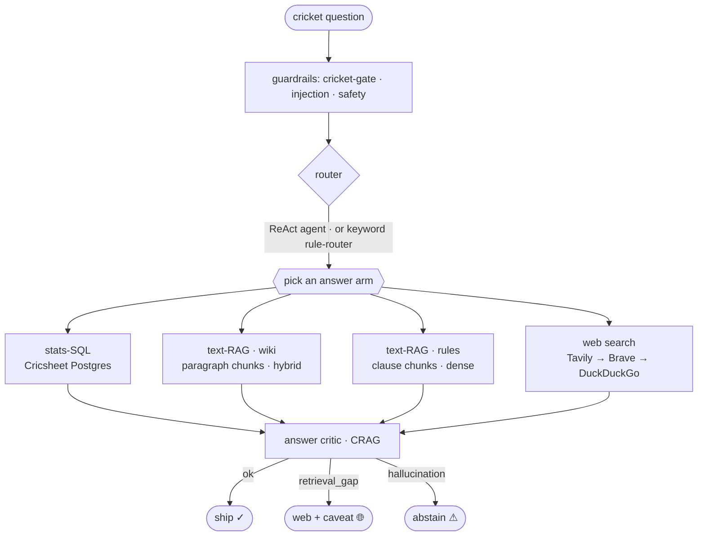
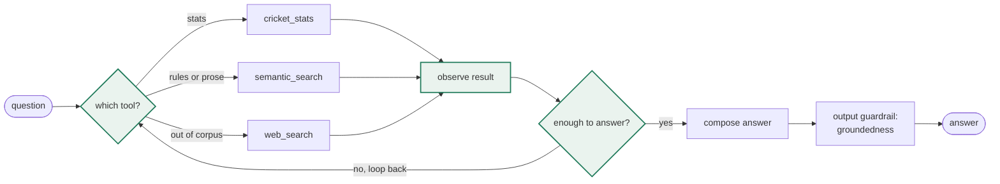
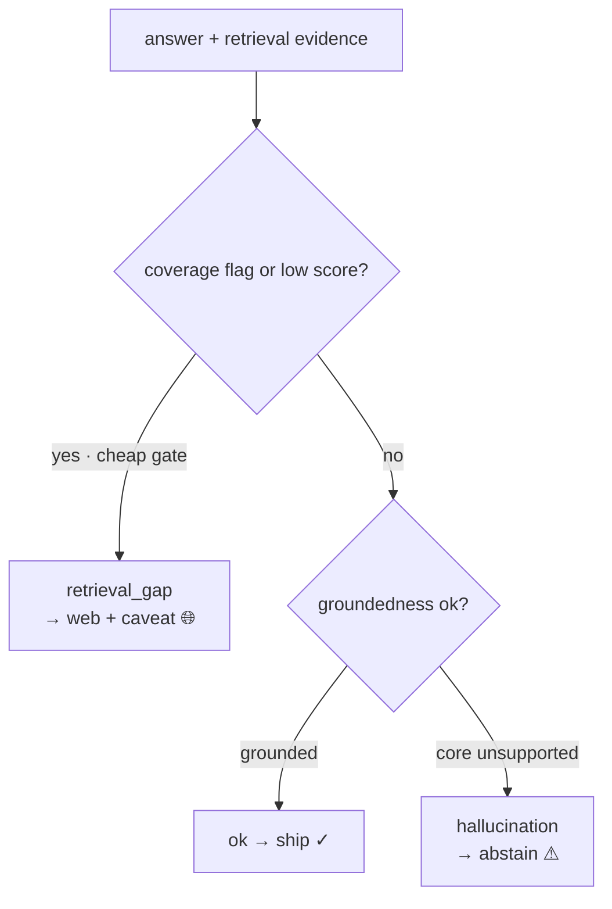

# Cricket Guru

A cricket question-answering agent that routes each question to the source that actually holds the answer — exact numbers from a structured match database, narrative from an encyclopedic text index, and a web-search freshness check for records. Built to compare, at each pipeline leg, two prominent approaches against a simple baseline rather than reaching for the optimal one first.

Group: IP8, Cricket Guru. Framework: Pydantic AI.

Live app (v1, frozen at the `v1` tag): <https://cricket-guru-production.up.railway.app>

v2 (on `main`, separate deploy): <https://cricket-guru-v2-production.up.railway.app> — what changed and the measured gains are in the [v2](#v2) section.

## Demo

https://github.com/user-attachments/assets/7cd8e437-fc19-4e2f-b517-6be3af796be5

## The idea

Cricket knowledge lives in two incompatible shapes. Prose holds narrative (why a match mattered, how a rule works); structured records hold exact facts (most runs in IPL 2016). No single retrieval method serves both, and records go stale the moment they break. So Cricket Guru is an agent that reads the question and picks the right tool, and the project measures where each approach wins.

## How it works

A question passes input guardrails (cricket-relevance, a prompt-injection check, safety), the router picks how to answer, one arm answers, and a critic decides whether it ships.



Three arms answer:

- **stats-SQL** — text-to-SQL over the Cricsheet Postgres. The model writes one read-only query, it runs, and a phraser turns the rows into a sentence. This is the objective oracle for numbers; it can't answer history, records, or captaincy (there is no captain column), so those route to prose.
- **text-RAG** — retrieve chunks from Qdrant (wiki prose or the rules corpus) and answer only from them.
- **web search** — a freshness check for records and facts the corpus can't hold.

The router is either a keyword rule-router (the baseline) or a Pydantic AI tool-calling agent (the serving default). The agent runs a ReAct loop: think about which tool the question needs, call it, read the result, and loop until it can answer, trying another tool when one comes up short.

On the wiki arm a **cross-encoder reranker** (`bge-reranker-base`) re-scores the top 20 retrieved chunks and keeps the top 5, which lifts wiki recall@1 from 60% to 80% — the right passage is usually retrieved but ranked too low. It is wiki-only: rules already rank the right clause first about 90% of the time, where reranking slightly hurts.

## The ReAct loop

The agent thinks about which tool the question needs, calls it, reads the result, and loops until it can answer. When one tool comes up short, it tries another; the final answer passes a groundedness guardrail before the critic sees it.



The multi-step gold set exists to check the loop actually decomposes: a question that needs two tools (a stats lookup feeding a rules lookup) is scored on both the answer and the trace, so a right answer reached in one hop still fails.

## The CRAG critic

After the agent returns, a critic grades the finished answer and, on a bad grade, takes a corrective action instead of shipping (Corrective RAG).



- **ok** — grounded, and its scope sits inside the data window. Ship.
- **retrieval_gap** — the corpus lacks it and the web can reliably fill it (a recent result, prose the encyclopedia doesn't hold). Ship the web answer with a caveat.
- **hallucination / abstain** — the evidence doesn't support the answer, or it is an all-time record reaching before the data window, where the database figure is truncated and the web can't be trusted for the precise value. Abstain, and show the reason.

The coverage call is the critic model's own reasoning over the data window, not a regex. Give it the window (Tests 2001+, ODIs 2002+, T20Is 2005+, IPL 2008+) and it works out scope: a T20I record is complete because T20Is only exist inside the window; an all-time Test record is not, because Tests date to 1877. An earlier regex version flagged any "highest/most" question and wrongly sent a complete in-window record ("highest India–Australia T20 total", 235) to the web, which handed back a wrong 272. The model reasons it through and ships the 235.

## What's compared (each leg: baseline → advanced, one leg at a time)

This is an offline eval, not a mode in the app: `python -m cricket_guru.eval.run_experiments` runs each leg's baseline against its advanced variant on the frozen gold set, across combinations. The app serves the one configuration that won.

| Leg | Baseline | Advanced |
|---|---|---|
| L1 Chunking | fixed-size | structural |
| L3 Retrieval | dense | hybrid (dense + BM25) |
| L4 Reranking | bi-encoder ranking | cross-encoder rerank on wiki (`bge-reranker-base`) |
| L5 Routing | rule/keyword | LLM tool-calling agent |
| L6 Judge | same-model | cross-model (different model, same vendor) |

## What each leg taught

Each entry is the change and the real example that drove it (red = before, green = after).

**Chunking.** Rules split on clause numbers, wiki on paragraphs. Structural chunking degrades to arbitrary windows on rulebook PDFs, which have no paragraph breaks, so rules needed a clause-aware splitter. On Law 35 (Hit Wicket), a fixed window cuts a clause in half; the clause-aware splitter keeps one rule per chunk:

```diff
  Law 35 (Hit Wicket), from the ICC playing-conditions PDF:
- FIXED ~320-char window — the chunk ends inside a clause, mid-word:
-   …35.1.1.2 in setting off for the first run immediately after playing at the ball,
-   35.1.1.3 if no attempt is made to play the ba        ← chunk boundary, mid-word
+ CLAUSE-AWARE — split on the clause numbers, one rule per chunk:
+   35.1.1    The striker is out Hit wicket if, after the bowler has entered the delivery
+             stride and while the ball is in play, his wicket is broken by the striker's
+             bat or person in any of the following circumstances …
+   35.1.1.3  if no attempt is made to play the ball, in setting off for the first run …
```

**Retrieval.** Dense for rules, hybrid for wiki. On rulebooks the BM25 half of hybrid latches onto surface words and floats a lexically-similar but wrong clause to the top, so the rules arm uses pure dense cosine (the hit score is that cosine, not the fused rank):

```diff
  "what happens when the ball hits a fielder's helmet on the ground?"
- HYBRID top hit — BM25 grabs the word "fielder", wrong clause:
-   28.2.3  If a fielder illegally fields the ball …                       score 0.748
+ DENSE top hit — cosine reads the meaning, right clause:
+   28.3.2  If the ball … strikes a protective helmet worn by a fielder …  score 0.779
```

recall@k confirms the split (dense leads @1 on rules, hybrid @1 on wiki), and a cross-encoder reranker lifts wiki recall@1 from 60% to 80% — wiki-only, since it measured worse on rules.

**Routing.** Good tool descriptions and coverage notes do the routing, not hardcoded keyword rules; a small model kept pace with a strong one on that basis (the numbers here are measured on Sonnet). The biggest narrative finding surfaced here — accuracy was **route-capped, not retrieval-capped**:

```diff
  "most wickets in a single World Cup" — looks statistical, but it's an all-time record
- Misrouted → cricket_stats — the DB starts at 2001, can't answer; agent stuck at 64%
+ Tool contracts made concrete about what each source holds → semantic_search (prose); ~84%
```

The wiki arm alone answers 96% of narrative questions, so the bottleneck was orchestration, not retrieval.

**Stats-SQL.** The biggest lever was the schema. A bare column list let the model infer meaning from column names and guess wrong — `runs_batter` (runs off one ball, 0–6) read as an innings total:

```diff
  "which match did Kohli score his 82 in?"   (82 is an innings total)
- BARE column list — runs_batter treated as the total:
-   … GROUP BY runs_batter HAVING SUM(…) = 82   →  []   (no single ball scores 82)
+ ANNOTATED schema (each column's meaning, units, granularity):
+   SUM(runs_batter) GROUP BY match, innings = 82   →  match found ✓
```

The annotated schema also states what the database *can't* hold (no captaincy, no pre-window records) so those route to prose. Two later traps from live queries: `COALESCE(SUM(...), 0)` turned "no rows" into a real-looking 0 that shipped as a tally (an all-NULL row now reads as empty and retries), and a renamed franchise sitting under two names meant a filter on one read half the club — the arm now cross-checks each team filter against the other names in the table.

**Critic.** Coverage reasoning belongs in the model, not a regex:

```diff
  "highest India–Australia T20 total?"   (235 — complete, T20Is only exist post-2005)
- OLD regex flagged every "highest/most" → sent to web → returned a WRONG 272
+ MODEL reasons about the data window → in-window and complete → ships 235
```

And the web proved unreliable for precise all-time records ("most Test wickets ever" came back 272, then Warne's 708, when it's Muralitharan's 800), so a record the agent can't verify abstains with the reason instead of shipping a guess.

**Judge.** A second model grades the answers, so a model can't mark its own homework. Sonnet answers and Haiku grades — same vendor, shared training, which weakens the check; a non-Anthropic judge would make it stronger. The sign flipped when the pair changed: under the earlier gpt/Sonnet pair the self-judge scored the agent lower than the cross-judge (56% vs 60%); under Sonnet/Haiku it scores higher (88% vs 84%). That is the direction self-preference predicts, but Haiku simply grading stricter explains it just as well, and a same-vendor pair can't separate the two. Read the same-vs-cross gap as a floor on self-preference, not a measurement of it.

**Tool concurrency.** A question that needs two tools used to hang forever — the model returns two tool calls in one turn, the framework runs them on worker threads, and each tool answers by starting its own event loop, so two at once wedge with no timeout able to see it:

```diff
  "how many more runs did the IPL 2015 top scorer make than 2011?"   (two lookups)
- parallel tool calls → two nested event loops → wedged, > 200s, nothing logged
+ parallel_tool_calls = false → tools run one at a time → answers in 23s
```

Every LLM call now carries a deadline too, so a stall reports itself.

**Gold and eval.** The narrative gold started from the raw Stack Exchange `cricket` Q&A, but community accepted answers aren't anchored to a retrievable passage and some had gone stale, so grading against them scored the gold as much as the system. Stack Exchange was dropped; the narrative gold is now 25 corpus-grounded questions whose reference is the actual Wikipedia passage the arm should retrieve.

**Serving path (what pushed us to v2).** The per-leg ablations tune each leg in isolation; profiling the assembled serving path is what exposed the next round of work. Most of the wall time sat in the agent's ReAct loop, with the input guard, output guard, and critic running serially behind it. And a cluster of misses were false abstentions the system talked itself into — a recent result read as fabricated because the model had no idea what year it was, a correct "this rule doesn't apply in Tests" flagged as unsupported, a split-year season like `2022/23` counted as two calendar years. Those became [v2](#v2).

## Experiments and gold

Each leg is ablated one at a time against a baseline (fixed chunking, dense retrieval, rule-router, same-model judge), scored end-to-end on a fixed gold set.

The gold is **corpus-grounded**: the reference is the actual source passage or clause, not a self-written answer. That matters more than it sounds. An earlier gold with self-written references let the system look 87–100% accurate on narrative; regrading against the real Wikipedia passages put it at 56–60%. The corpus-grounded gold measures the system, not the gold's own quality.

- **stats gold** — exact-match against the SQL oracle.
- **rules gold** — the reference is a rulebook clause; a verify pass drops any question the clause can't answer.
- **narrative gold** — the reference is a Wikipedia passage, same verify pass.
- **multi-step gold** — needs two tools composed; scored on answer and trace.

For the retrieval and chunking legs, end-to-end accuracy is too noisy: a retrieval gain drowns in the answerer and judge. So those legs also report **recall@k** — ask the question, take the top-k chunks, check whether the gold clause is among them. No LLM, no judge, and it moves when retrieval actually improves. That is what surfaced the dense-vs-hybrid split cleanly: on rules, dense leads at rank 1; on wiki, hybrid does.

Reused projects or fabricated evaluation data are out of scope; every number the harness prints comes from a live run over the frozen gold set. The harness-audit findings (prompt leakage, noise-swamped legs) and the build-time gold curation and judge validation are in [docs/how-it-works.md](docs/how-it-works.md).

### Serving baseline (v1)

The ablations above measure one leg at a time; this is the whole serving path — guards, agent, tools, critic — over the same 120-item gold, which is the number a user actually gets (`backend/cricket_guru/eval/latency_profile.py`):

| type | accuracy | median latency |
|---|---|---|
| stats | 75% (46/61) | 18.3s |
| narrative | 68% (17/25) | 23.8s |
| rules | 90% (26/29) | 19.2s |
| multi-step | 40% (2/5) | 30.5s |
| **all** | **76% (91/120)** | **19.7s** |

The agent loop dominates the latency (~15.5s mean); the two guards and the critic add a few seconds each, in series behind it.

## v2

Same architecture, a reworked serving path. v2 deploys separately from v1 (frozen at the `v1` tag) off the same repo — <https://cricket-guru-v2-production.up.railway.app>, tracking `:latest` from `main`.

**Correctness — fixed at the source, not by editing the gold.**

- The agent and critic had no notion of *today*, so a recent result read as fabricated and abstained. Both now receive the current date, and cricket on or before today counts as real.
- Cricsheet's `season` is a split-year label: `2022/23` is one season, not two calendar years. The SQL guidance no longer expands it into a year range, which had been double-counting.
- Bare table names (`matches` vs `cricsheet.matches`) errored and burned a retry; a `search_path` on the connection resolves them.
- The critic used to abstain to "prove a negative," flagging a correct "this rule doesn't apply in Tests" as unsupported. It now abstains only when the evidence positively contradicts the answer.
- Two gold records were themselves wrong — the all-time Test and ODI run leaders were labelled with the in-window top scorer instead of Tendulkar. Corrected.

**Latency.** Profiling put most of the wall time in the ReAct loop, the guards and critic serial behind it.

- The mechanical legs moved to Haiku: the input gate (classify) and the stats phraser (rows → sentence). The groundedness guard did *not* — it feeds a forced-abstain gate, and on Haiku it over-rejected five correct answers, so it stays on Sonnet. Cheapen classify and format; leave judgment on the strong model.
- The ReAct loop re-sends the same system prompt and four tool definitions on every call, up to ten per question. Anthropic prompt caching serves that prefix from cache after the first call (~0.1× the token price, and ~11% off the loop's wall time). It needed pydantic-ai's Anthropic cache settings, so the stack moved to pydantic-ai 2.x on Python 3.10+ (the deployed image was already 3.11).

**Measurements** (same 120-item serving benchmark):

| | accuracy | median latency |
|---|---|---|
| v1 baseline | 76% (91/120) | 19.7s |
| v2 | 79% (95/120) | 17.7s |

The gain concentrates in stats (75% → 82%, from the season and date fixes), and abstentions dropped from 10 to 5; narrative, rules, and multi-step held flat. Per leg, the agent loop fell from 15.5s to 12.6s mean — caching plus fewer wasted retries — and the stats phraser from 9.0s to 6.4s on Haiku.

**Next steps.**

- Trim the agent_run tail: p95 is ~42s and the slowest narrative questions still run past a minute (the caching and fixes already cut the worst case from 172s to 76s).
- Extend caching to the SQL-generator and critic prompts, and tune the TTL — the 5-minute default expires between sporadic questions, and a 1-hour TTL breaks even at three reads.
- A non-Anthropic judge to strengthen the same-vs-cross check; today Sonnet answers and Haiku grades, same vendor.

## Layout

```
backend/cricket_guru/
  config.py         env-driven settings + PipelineConfig (the leg "mode" object)
  db.py  qdrant_store.py  llm.py
  ingest/           fetch + load: Cricsheet, Wikipedia, rule books, Sports SE (legacy)
  index/            L1 chunking (fixed|structural), FastEmbed, build_index CLI
  retrieval/        L3 dense | hybrid, L4 cross-encoder rerank
  arms/             text_rag, stats_sql (shared answer() interface)
  routing/          L5 rule | agent (Pydantic AI)
  tools/            web-search freshness (frozen at eval time)
  eval/             gold_* (corpus-grounded), judge, harness, run_experiments, retrieval_recall
frontend/app.py     Streamlit: chat + traces + how-it-works
```

## Data

- [Cricsheet](https://cricsheet.org) ball-by-ball (men's intl + IPL): 8,142 matches, 4.14M deliveries → Postgres (`cricsheet`). The objective oracle for numbers.
- [Wikipedia](https://en.wikipedia.org) cricket articles (via the MediaWiki API): 575 → Qdrant (`wiki_fixed` / `wiki_structural`). The narrative corpus; the narrative gold is grounded in these passages.
- Rule books — [MCC Laws of Cricket](https://www.lords.org/mcc/the-laws-of-cricket) plus [ICC](https://www.icc-cricket.com) and [IPL](https://www.iplt20.com) playing conditions: PDF → text → Qdrant (`rules_fixed` / `rules_structural`). The laws corpus.
- [Sports Stack Exchange `cricket` tag](https://sports.stackexchange.com/questions/tagged/cricket): 839 Q, 459 accepted → Postgres (`sports_se`). The original narrative oracle, later dropped from the gold in favour of the corpus-grounded Wikipedia references (see [docs/how-it-works.md](docs/how-it-works.md)).

All CC-BY-SA / ODC; raw data is git-ignored and reproduced by the fetch/load scripts. See `data/README.md`.

## Run it (local)

```bash
python3 -m venv .venv && .venv/bin/pip install -r backend/requirements.txt streamlit
cp backend/.env.example backend/.env      # add ANTHROPIC_API_KEY + TAVILY_API_KEY

# one-time ingestion (Postgres running locally)
export PYTHONPATH=backend
.venv/bin/python -m cricket_guru.ingest.fetch_wikipedia
psql -d cricket_guru -f backend/cricket_guru/ingest/schema.sql
.venv/bin/python -m cricket_guru.ingest.load_cricsheet     # after extracting Cricsheet zips to data/cricsheet
.venv/bin/python -m cricket_guru.ingest.load_rules         # after dropping rule PDFs into data/rules (see data/rules/README.md)
.venv/bin/python -m cricket_guru.index.build_index --source wiki  --chunking fixed
.venv/bin/python -m cricket_guru.index.build_index --source wiki  --chunking structural
.venv/bin/python -m cricket_guru.index.build_index --source rules --chunking fixed
.venv/bin/python -m cricket_guru.index.build_index --source rules --chunking structural

# experiments (gold sets ship committed under data/gold/)
.venv/bin/python -m cricket_guru.eval.run_experiments --n 15

# app
.venv/bin/streamlit run frontend/app.py
```

## Deploy (single machine)

`deploy/Dockerfile` bakes Postgres, the Streamlit app, and the on-disk Qdrant index into one image, so the container comes up self-contained. LLM keys come from the host env, never the image. This is what runs the live demo on Railway; `deploy/` holds the entrypoint and `.github/workflows/` the CI that builds the image.

## Models

The answerer, arms, agent, and critic run on `CG_ANSWERER_MODEL` (`anthropic:claude-sonnet-5`); the eval cross-judge on `CG_JUDGE_MODEL` (`anthropic:claude-haiku-4-5`). Web search is Tavily, embeddings are local FastEmbed, so serving needs only the Anthropic key plus Tavily for the web fallback — no OpenAI. Set the models in `.env` as Pydantic AI `provider:model` strings.
