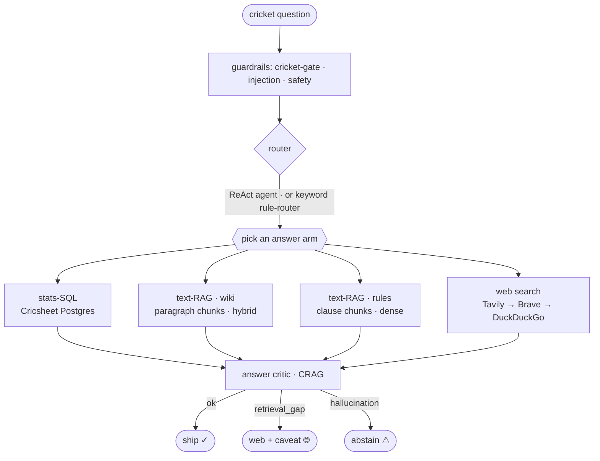
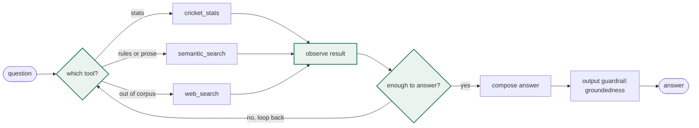
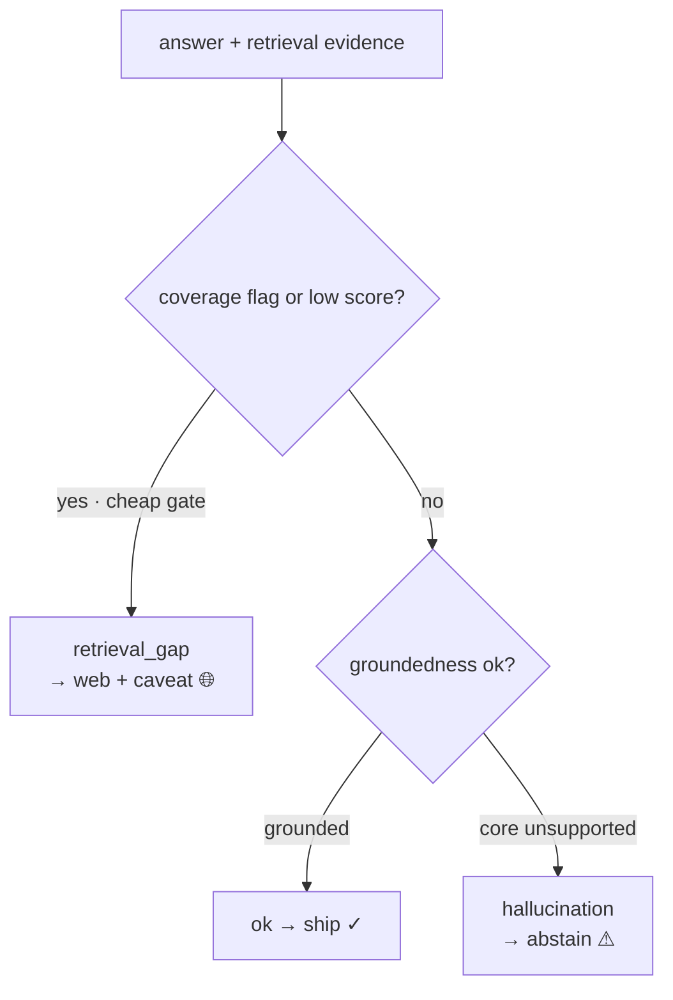

# Cricket Guru — how it works

Cricket Guru answers cricket questions by routing each one to the source that actually holds the answer: a Postgres database of ball-by-ball match data for stats, a vector index of encyclopedia prose and rule books for narrative and laws, and a web-search check for records that reach outside the data. An agent reads the question, picks the tools, and a critic checks the answer before it ships.

The project's second goal is comparison. At each pipeline leg — chunking, retrieval, routing, judging — it runs a simple baseline against a more advanced approach and reports the delta, instead of assuming the advanced one wins.

## Data gathering

Three sources, each fetched and normalized by a script under `backend/cricket_guru/ingest/`. Raw data is gitignored; the scripts reproduce it.

- **Cricsheet (stats).** Ball-by-ball match data, loaded into Postgres (`load_cricsheet.py`) as four tables: `matches`, `innings`, `deliveries`, `player_lineups`. Coverage starts where Cricsheet's ball-by-ball data does — Tests from Dec 2001, ODIs 2002, T20Is 2005, IPL 2008. That window matters later, because the critic reasons about it.
- **Wikipedia (narrative).** Cricket articles pulled through the MediaWiki API (`fetch_wikipedia.py`) into `articles.json`: prose on matches, players, and controversies.
- **Rule books (laws).** The MCC Laws and the ICC playing conditions (Test/ODI/T20I), plus IPL conditions, extracted from PDF to text (`load_rules.py`) into `rules.json`, one record per page with its source and page number.

Every record carries attribution fields for CC-BY-SA / ODC compliance. The stats database is the objective oracle for numbers; the prose and rules corpora feed the vector index.

## Vector database

Prose and rules go into Qdrant (on-disk locally, a server in Docker). Embeddings are `bge-small-en-v1.5` (384-dim) via FastEmbed, which pulls ONNX Runtime rather than torch, so the image stays small.

The index is built per `(source, chunking)` pair — `wiki_fixed`, `wiki_structural`, `rules_fixed`, `rules_structural` — so the chunking and retrieval experiments compare variants without re-embedding on the fly (`index/build_index.py`).

Two retrieval modes:

- **dense** — cosine over the bge embeddings.
- **hybrid** — dense fused with BM25 (lexical) via reciprocal-rank fusion.

Which one wins depends on the corpus, and the recall@k numbers are decisive. On rules, dense beats hybrid because BM25 pulls lexically-similar-but-wrong clauses to the top (a question about a fielder's helmet retrieves "a fielder illegally fields the ball"). On wiki prose, hybrid beats dense because names, places, and dates are real lexical anchors. So the serving path uses **dense for rules, hybrid for wiki**.

On wiki, a **cross-encoder reranker** (`bge-reranker-base`) sits on top: retrieve the top 20 with the bi-encoder, then re-score the pairs jointly and keep the top 5. It lifts wiki recall@1 from 60% to 80% — the right passage is usually retrieved but ranked too low, and the cross-encoder reads question and chunk together to fix the order. It's wiki-only: on rules, where the right clause already ranks first about 90% of the time, reranking slightly hurts, so the rules arm stays on plain dense. Both effects were measured with recall@k before wiring anything in.

## Architecture

A question passes input guardrails (cricket-relevance, safety, a prompt-injection regex), the router picks how to answer, an arm answers, and the critic decides whether it ships.

The three arms:

- **stats-SQL** — text-to-SQL over Postgres: the model writes one read-only query, it runs, a phraser turns the rows into a sentence. Blind to prose; its own data is the objective oracle for stats.
- **text-RAG** — retrieve chunks from Qdrant (wiki or rules) and answer only from them.
- **web-search** — a freshness check for when the corpus can't hold the answer.

The router is a keyword rule-router (baseline) or an LLM tool-calling agent (advanced). The agent is the serving default.

## The ReAct loop

The agent thinks about which tool the question needs, calls it, reads the result, and loops until it can answer. When one tool comes up short, it tries another; the final answer passes a groundedness guardrail before the critic sees it.

The multi-step gold set exists to check the loop actually decomposes: a question that needs two tools (a stats lookup feeding a rules lookup) is scored on both the answer and the trace, so a right answer reached in one hop still fails.

## The CRAG critic

After the agent returns, a critic grades the finished answer and, on a bad grade, takes a corrective action instead of shipping (Corrective RAG).

- **ok** — grounded, and its scope sits inside the data window. Ship.
- **retrieval_gap** — the corpus lacks it and the web can reliably fill it (a recent result, prose the encyclopedia doesn't hold). Ship the web answer with a caveat.
- **hallucination / abstain** — the evidence doesn't support the answer, or it is an all-time record reaching before the data window, where the database figure is truncated and the web can't be trusted for the precise value. Abstain, and show the reason.

The coverage call is the critic model's own reasoning over the data window, not a regex. Give it the window (Tests 2001+, ODIs 2002+, T20Is 2005+, IPL 2008+) and it works out scope: a T20I record is complete because T20Is only exist inside the window; an all-time Test record is not, because Tests date to 1877. An earlier regex version flagged any "highest/most" question and wrongly sent a complete in-window record ("highest India–Australia T20 total", 235) to the web, which handed back a wrong 272. The model reasons it through and ships the 235.

## What each leg taught us

- **Chunking.** Rules split on clause numbers, wiki on paragraphs. Structural chunking degrades to arbitrary windows on rulebook PDFs, which have no paragraph breaks, so rules needed a clause-aware splitter.
- **Retrieval.** Dense for rules, hybrid for wiki (above); the hit score is the dense cosine, not the fused rank.
- **Routing.** A small answerer (gpt-mini) routes on par with a strong model when the tools carry good descriptions and coverage notes, without hardcoded keyword rules. The biggest narrative finding surfaced here: accuracy was **route-capped, not retrieval-capped**. The wiki arm on its own answers 96% of narrative questions, but the agent managed 64% — it misrouted history and record questions that *look* statistical ("most wickets in a single World Cup", "Kohli's captaincy record") to the stats arm, where they can't be answered. Making the tool contracts concrete about what each source can and can't hold lifted the agent to ~84%. The bottleneck was orchestration, not retrieval.
- **Stats-SQL.** The biggest lever was the schema. A bare column list made the model infer meaning from column names and guess wrong: `bowling_team` on the wrong table, `runs_batter` (runs off one ball, 0–6) treated as an innings total, so "which match did Kohli score 82 in?" returned nothing. An annotated schema — every column's meaning, units, and granularity — fixed those. It also spells out what the database *can't* hold: no captaincy (there is no captain column), no records that predate the window — so those route to prose instead of the model fabricating them from lineups or matches played. Two more props hold up the small model on hard queries: an empty-result retry that loosens over-constrained SQL, and a note that "X runs off Y balls" is innings notation, not a filter on ball number. It's the same thing a database MCP would surface, authored once.
- **Critic.** Coverage reasoning belongs in the model, not a regex (above). And the web proved unreliable for precise records ("most Test wickets ever" came back as 272, then Warne's 708, when the answer is Muralitharan's 800), so a record the agent can't verify abstains with the reason instead of shipping a possibly-wrong number.
- **Judge.** Cross-vendor judging (gpt answers, Sonnet grades) dodges same-model self-preference. Validated against human labels, with no same-judge bias found.

## Experiments and gold

Each leg is ablated one at a time against a baseline (fixed chunking, dense retrieval, rule-router, same-model judge), scored end-to-end on a fixed gold set.

The gold is **corpus-grounded**: the reference is the actual source passage or clause, not a self-written answer. That matters more than it sounds. An earlier gold with self-written references let the system look 87–100% accurate on narrative; regrading against the real Wikipedia passages put it at 56–60%. The corpus-grounded gold measures the system, not the gold's own quality.

- **stats gold** — exact-match against the SQL oracle.
- **rules gold** — the reference is a rulebook clause; a verify pass drops any question the clause can't answer.
- **narrative gold** — the reference is a Wikipedia passage, same verify pass.
- **multi-step gold** — needs two tools composed; scored on answer and trace.

For the retrieval and chunking legs, end-to-end accuracy is too noisy: a retrieval gain drowns in the answerer and judge. So those legs also report **recall@k** — ask the question, take the top-k chunks, check whether the gold clause is among them. No LLM, no judge, and it moves when retrieval actually improves. That is what surfaced the dense-vs-hybrid split cleanly: on rules, dense leads at rank 1; on wiki, hybrid does.

## Building it: gold curation and judge validation

Two build-time steps don't ship in the demo but shaped the numbers, so they belong here.

**Gold curation.** The gold is corpus-grounded, but a model still writes the question, so some come out unanswerable or off. A verify pass drops the worst automatically (a rules question whose clause doesn't actually answer it), and the rest went through a keep/drop review where a human is the label of record and the model's pre-flag is only a suggestion. That is why the rules gold dropped a bad concussion-deadline item, and the narrative gold is 25 clean passage-grounded questions rather than the raw Stack-Exchange set we started from.

**Judge validation (Phase-B).** An LLM judge is only worth trusting if it agrees with a human. So we hand-labeled a set of answers correct/incorrect against the reference, with the judges' own verdicts hidden so they couldn't anchor us, then compared afterward. On 21 decisive items the gpt judge matched the human 21/21 and the Sonnet judge 20/21. That is what lets the judge scores — and the same-vs-cross comparison — mean anything: the grader is ~95–100% human-aligned.

Both ran from small Streamlit labeling screens during development. They are not in the shipped app (a public demo doesn't need the curation tools), but the gold and the validation they produced are what the whole evaluation rests on.
